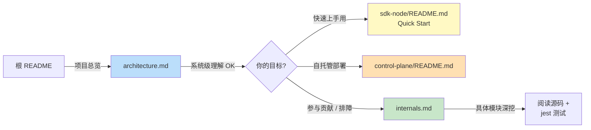

# Inferable 文档中心

欢迎来到 Inferable 项目的深度文档区。本目录补充[官方文档](https://docs.inferable.ai/)与各组件 README，专注于**项目级架构理解**与**控制平面源码深度解读**，帮助开发者快速建立心智模型并参与贡献。

---

## 📚 文档索引

### 1. [architecture.md — 系统架构与数据流](./architecture.md)

**🎯 一句话简介**
从宏观视角讲清楚 Inferable 的系统组成、组件协作方式与典型工作流的端到端运行轨迹。包含 6 个 Mermaid 图：整体架构、Sequence 数据流、版本亲和性、Human-in-the-Loop 状态机、Monorepo 依赖、Run 时间线。

**👥 适用人群**

| 你是… | 这份文档能帮你… |
|---|---|
| **第一次接触 Inferable 的开发者** | 用 5–10 分钟建立项目全景图，知道每个目录是做什么的 |
| **正在评估技术选型的架构师** | 快速判断 Inferable 是否适合你的场景（异步工作流、HITL、多语言 SDK） |
| **决定要不要自托管的运维 / SRE** | 看清楚组件依赖（Postgres + Redis + LLM 提供商）与网络拓扑 |
| **需要画图给团队讲解的工程师** | 直接复制 Mermaid 源码到你的 Confluence / Notion / 演示文稿 |

**🧭 阅读建议**
按顺序从「整体系统架构」读到「Run 时间线」即可，无需任何源码背景。读完后建议接着看 [`sdk-node/README.md`](../sdk-node/README.md) 跑一个 Quick Start。

---

### 2. [internals.md — 控制平面内部机制](./internals.md)

**🎯 一句话简介**
基于 `control-plane/src/modules/{runs,jobs,queues}` 源码的深度剖析，回答「Inferable 是怎么做到防火墙后的 worker 能可靠执行任务」「崩溃后怎么自愈」「审批为什么不会丢消息」这些问题。包含 9 张细粒度 Mermaid 图与 4 段关键 SQL 模式。

**👥 适用人群**

| 你是… | 这份文档能帮你… |
|---|---|
| **想为 control-plane 提交 PR 的贡献者** | 在不读完 5000 行源码的前提下，理解任务调度、状态机和锁机制的设计意图 |
| **遇到 job 卡住 / 重复执行问题的用户** | 通过 self-heal、`FOR UPDATE SKIP LOCKED`、`remaining_attempts` 等机制定位根因 |
| **想自己实现 Durable Execution 的工程师** | 学习一套"PostgreSQL 任务表 + BullMQ Run 队列 + Redis 分布式锁"的实战模式 |
| **审计安全 / 一致性的技术评审** | 验证审批中断、版本亲和、原子认领等关键路径的正确性 |
| **构建可观测性 / 监控仪表盘的工程师** | 找到所有事件埋点（`jobAcknowledged`、`jobStalled`、`approvalGranted` 等）与状态字段 |

**🧭 阅读建议**
建议先读完 [`architecture.md`](./architecture.md) 再来阅读本文档。本文档会反复引用源码行号，建议**与 IDE 对照阅读**：
1. 先看「§2 核心概念：Run vs Job」建立词汇表
2. 顺序阅读 §3–§8（Job 生命周期 + 自愈）
3. 跳到 §9–§10 理解 Queue 与 Run 处理的并发控制
4. 最后用 §11 SQL 模式做查阅速查

---

## 🗺️ 推荐学习路径

---

## 📌 文档维护说明

- 这些文档基于本仓库**当前 main 分支**的源码生成。当 `control-plane/src/modules/` 中的核心模块发生重大变化时，请同步更新 [internals.md](./internals.md)。
- Mermaid 图源码内嵌在 Markdown 中，可在 GitHub、VS Code（带 Mermaid 插件）以及大多数现代 Markdown 渲染器中直接预览。
- 如发现内容与源码不符，欢迎提交 PR 修正——本目录采用与代码相同的 PR 流程。

---

## 🔗 其他相关文档

- 📖 [Inferable 官方文档](https://docs.inferable.ai/) — 用户视角的功能文档
- 🚀 [根 README](../README.md) — 项目总览与 SDK 列表
- 🛠️ [CONTRIBUTING.md](../CONTRIBUTING.md) — 贡献指南
- 📦 [sdk-node/README.md](../sdk-node/README.md) · [sdk-go/README.md](../sdk-go/README.md) · [cli/README.md](../cli/README.md) — 各组件快速上手
- ⚙️ [control-plane/README.md](../control-plane/README.md) — 自托管部署指南
