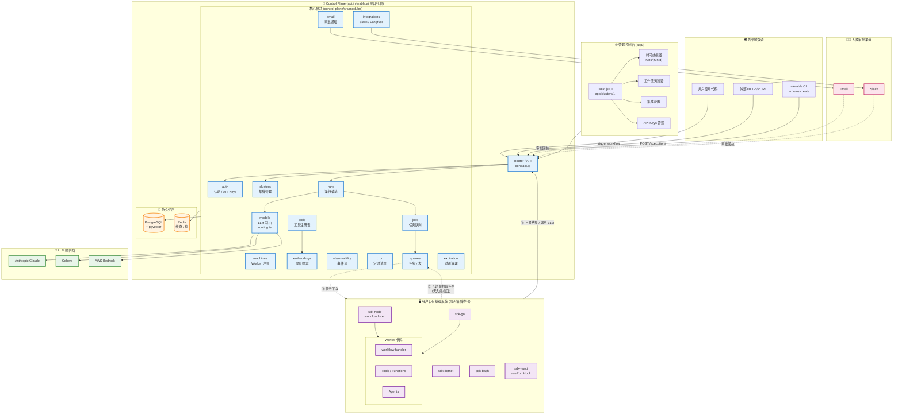
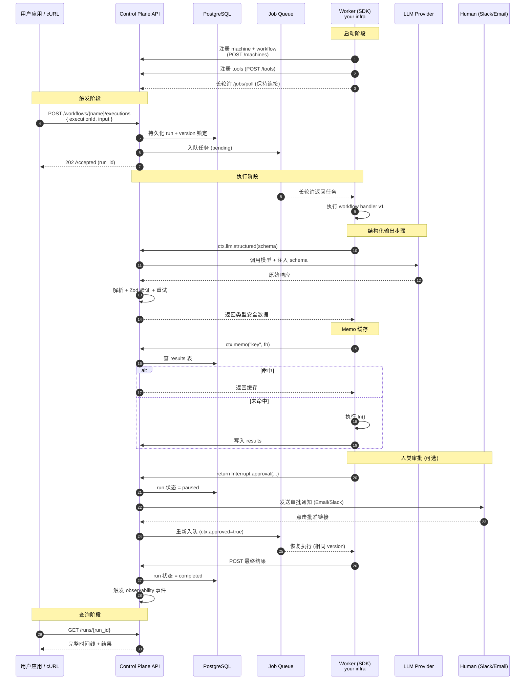
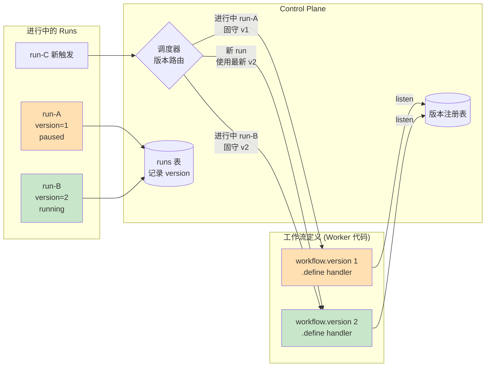
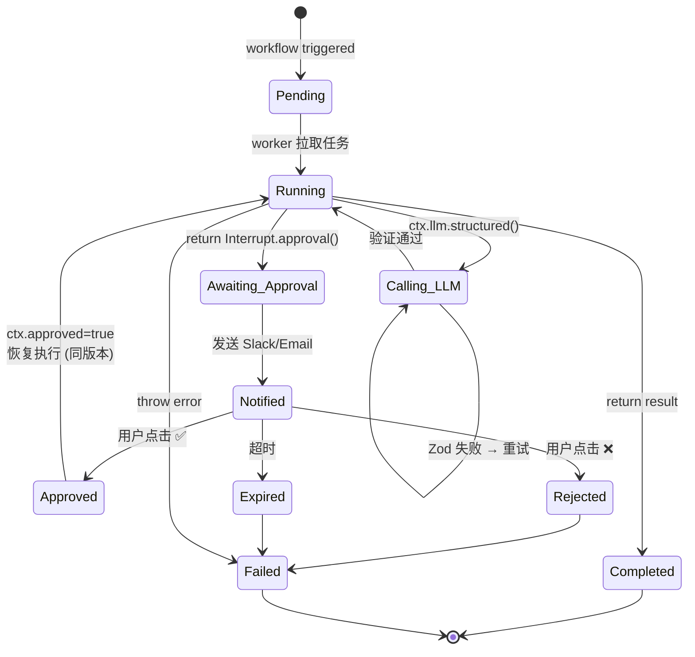

# Inferable 架构与数据流

本文档使用 [Mermaid](https://mermaid.js.org/) 图详细描述 Inferable 项目的整体架构、组件关系、运行时数据流以及核心机制（版本化、Human-in-the-Loop、可观测性等）。

> 在 GitHub、VS Code（带 Mermaid 插件）、或任何支持 Mermaid 的 Markdown 渲染器中可直接查看渲染图。

## 目录

1. [整体系统架构](#1-整体系统架构system-architecture)
2. [工作流执行端到端数据流](#2-工作流执行端到端数据流sequence)
3. [工作流版本控制与版本亲和性](#3-工作流版本控制与版本亲和性)
4. [Human-in-the-Loop 审批状态机](#4-human-in-the-loop-审批状态机)
5. [Monorepo 仓库内组件依赖](#5-monorepo-仓库内组件依赖)
6. [Run 内事件时间线（可观测性）](#6-run-内事件时间线可观测性)
7. [关键要点](#7-关键要点)

---

## 1. 整体系统架构（System Architecture）



---

## 2. 工作流执行端到端数据流（Sequence）



---

## 3. 工作流版本控制与版本亲和性

Inferable 通过 **版本亲和性（version affinity）** 机制保证向后兼容：进行中的 run 永远沿用其创建时的版本，新 run 自动使用最新版本。这允许 **渐进式发布**，无需中断正在执行的工作流。



---

## 4. Human-in-the-Loop 审批状态机

工作流可通过 `Interrupt.approval()` 暂停执行，等待人类（通过 Slack 或 Email）批准后再恢复。整个过程对工作流代码透明，状态由 Control Plane 持久化管理。



---

## 5. Monorepo 仓库内组件依赖

```mermaid
graph LR
    subgraph CoreSvc["核心服务"]
        ControlPlane[control-plane<br/>API + 调度]
        AppUI[app<br/>Next.js 控制台]
        CLI[cli<br/>@inferable/cli]
    end

    subgraph SDKs["SDK 客户端"]
        SDKNode[sdk-node]
        SDKGo[sdk-go]
        SDKDotnet[sdk-dotnet]
        SDKReact[sdk-react]
        SDKBash[sdk-bash]
    end

    subgraph Boot["脚手架"]
        BootNode[bootstrap-node]
        BootGo[bootstrap-go]
        BootDotnet[bootstrap-dotnet]
    end

    subgraph Demos["示例 / 测试"]
        QuoteSys[demos/quote-system]
        Loadtest[load-tests]
    end

    Contract[(共享 Contract<br/>类型定义)]

    ControlPlane <-.contract.-> Contract
    SDKNode <-.contract.-> Contract
    AppUI <-.contract.-> Contract
    CLI <-.contract.-> Contract
    SDKReact <-.contract.-> Contract

    BootNode --> SDKNode
    BootGo --> SDKGo
    BootDotnet --> SDKDotnet

    QuoteSys --> SDKNode
    Loadtest --> SDKNode

    AppUI -- HTTP --> ControlPlane
    CLI -- HTTP --> ControlPlane
    SDKNode -- 长轮询 --> ControlPlane
    SDKGo -- 长轮询 --> ControlPlane
    SDKDotnet -- 长轮询 --> ControlPlane
    SDKReact -- HTTP/SSE --> ControlPlane

    style ControlPlane fill:#bbdefb
    style AppUI fill:#bbdefb
    style CLI fill:#bbdefb
    style Contract fill:#fff9c4
```

---

## 6. Run 内事件时间线（可观测性）

下图为一次包含 LLM 结构化输出、工具调用与人工审批的典型 Run 时间线，对应控制台中的 timeline view。

```mermaid
gantt
    title 一次典型 Run 的事件时间线
    dateFormat  X
    axisFormat  %Ls

    section 调度
    workflow.triggered           :milestone, m1, 0, 0
    job.queued                   :a1, 0, 100ms

    section Worker
    job.picked-up                :a2, after a1, 50ms
    handler.start                :a3, after a2, 30ms

    section LLM
    llm.structured.invoke        :a4, after a3, 800ms
    llm.parse + zod.validate     :a5, after a4, 50ms

    section 工具调用
    tool.searchDatabase          :a6, after a5, 400ms

    section 人类审批
    interrupt.approval           :milestone, m2, after a6, 0
    email.sent                   :a7, after m2, 100ms
    awaiting.user                :crit, a8, after a7, 5s
    user.approved                :milestone, m3, after a8, 0

    section 收尾
    handler.resume               :a9, after m3, 200ms
    workflow.completed           :milestone, m4, after a9, 0
```



---

## 7. 关键要点

| 维度 | 说明 |
|---|---|
| **网络方向** | Worker **主动长轮询** Control Plane → 无需开放入站端口、防火墙友好 |
| **持久化** | PostgreSQL（含 pgvector 向量检索）+ Redis（缓存、分布式锁） |
| **LLM 路由** | `control-plane/src/modules/models/routing.ts` 决定路由到 Anthropic / Cohere / Bedrock |
| **共享契约** | `contract.ts` 在 control-plane / SDK / app 之间共享类型，保证一致性 |
| **版本亲和** | 进行中的 run 永远固守创建时的版本，新 run 使用最新版本 |
| **Memo** | 通过 `results` 表实现分布式缓存，避免重复执行昂贵操作 |
| **Interrupt** | 工作流可"暂停"，由 Slack/Email 回调"恢复"（相同 worker 版本继续执行） |

---

## 进一步阅读

- [docs/internals.md](./internals.md) — **控制平面内部机制**（runs/jobs/queues 模块任务调度详解）
- 项目根 [README](../README.md) — 项目总览
- [control-plane/README.md](../control-plane/README.md) — 控制平面本地开发与自托管
- [sdk-node/README.md](../sdk-node/README.md) — Node.js SDK 快速上手
- [sdk-go/README.md](../sdk-go/README.md) — Go SDK 快速上手
- [cli/README.md](../cli/README.md) — CLI 命令参考
- [Inferable 官方文档](https://docs.inferable.ai/)
