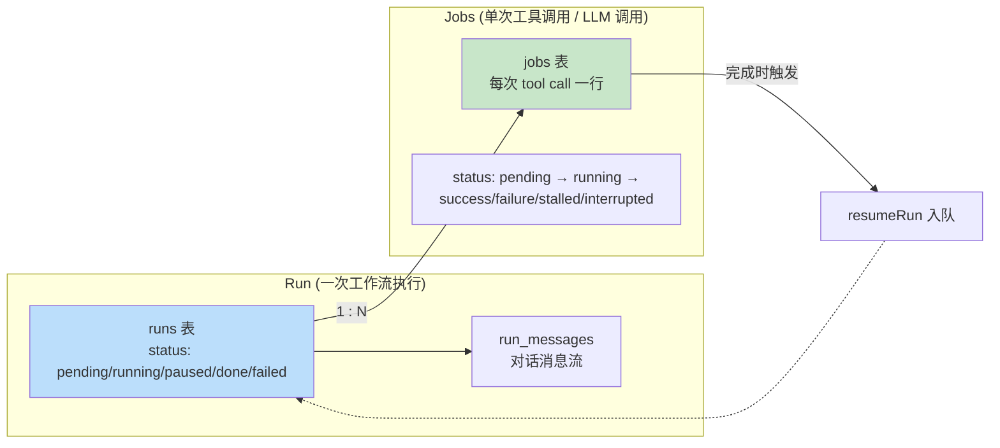
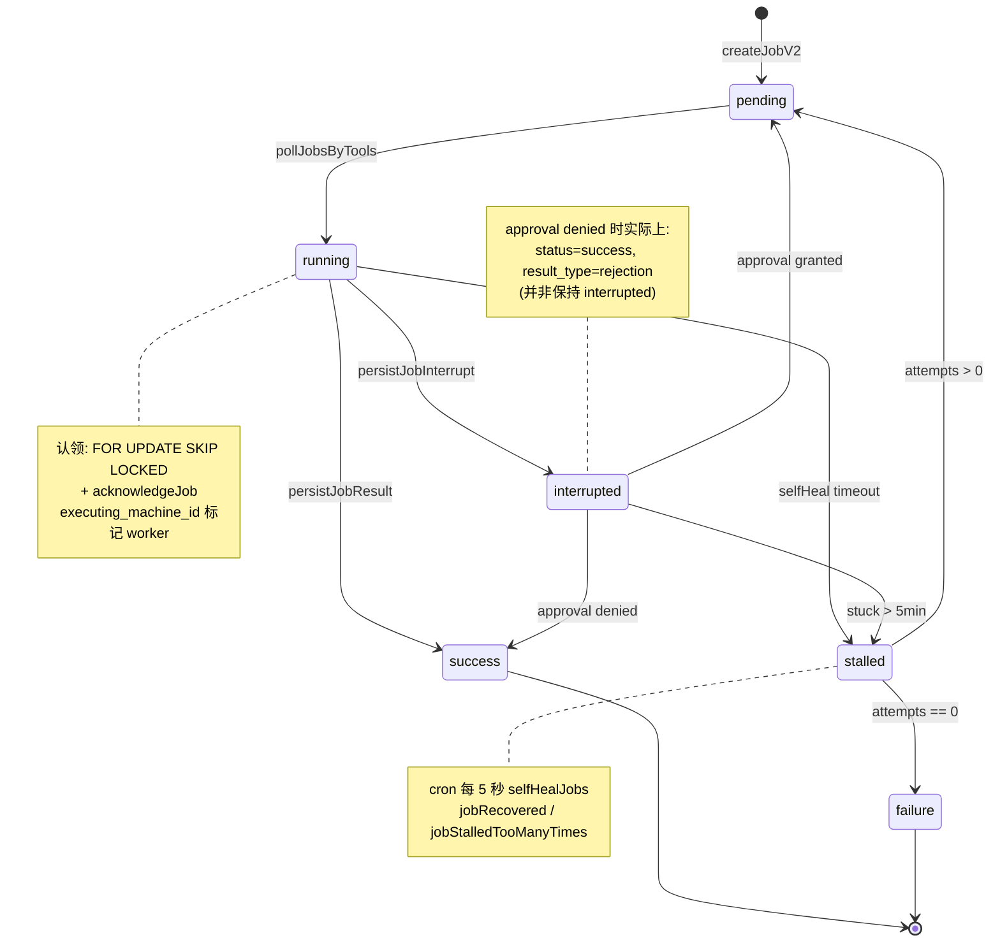
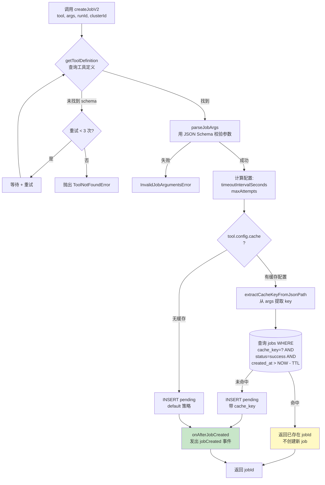
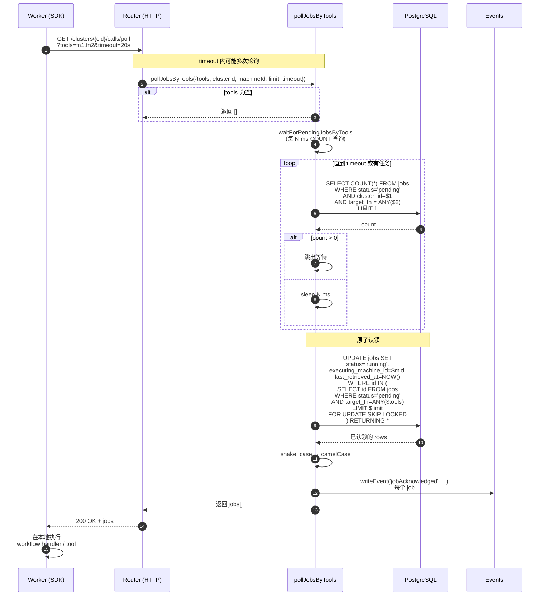
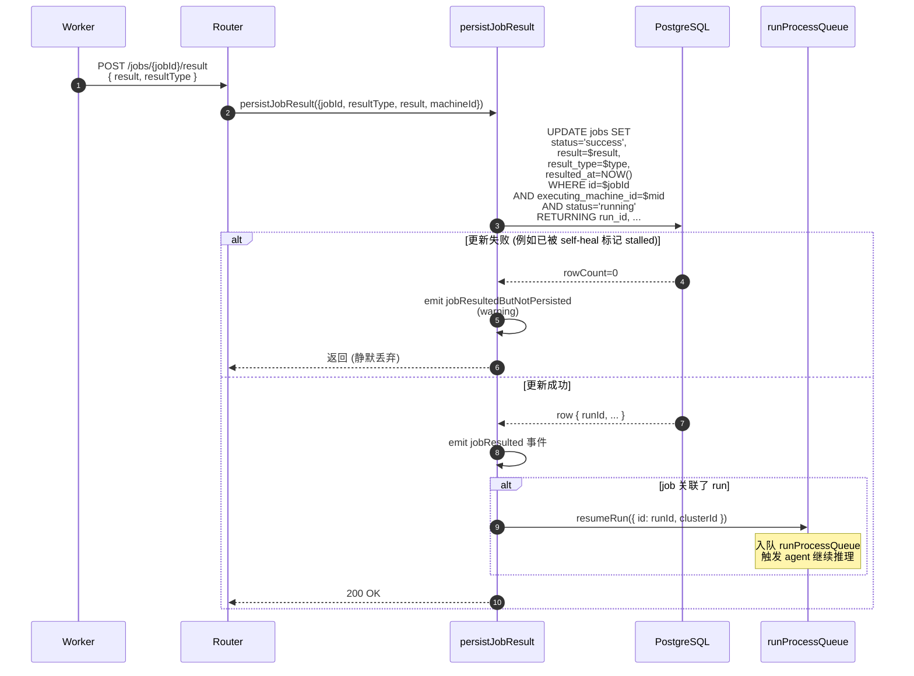
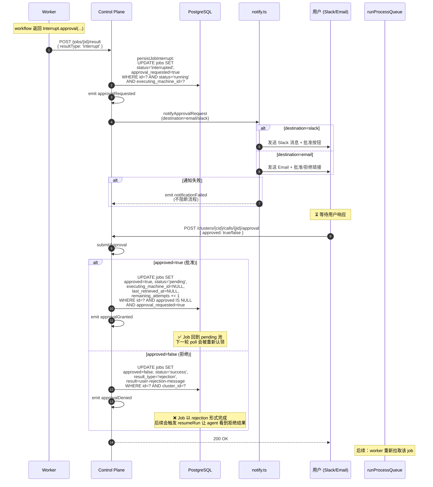
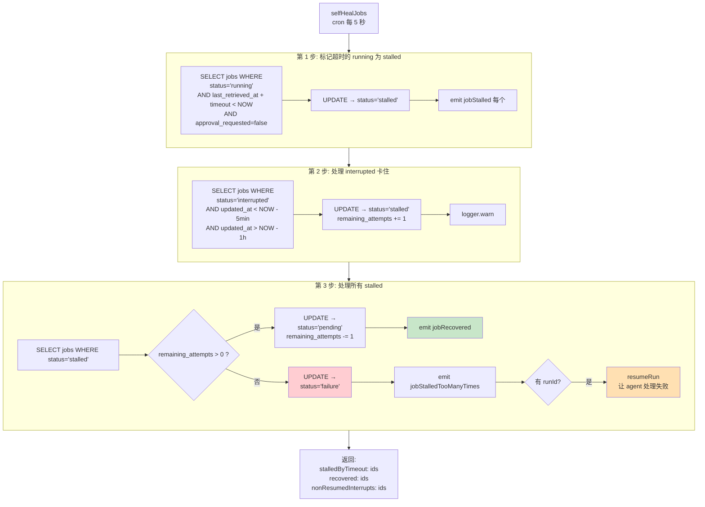
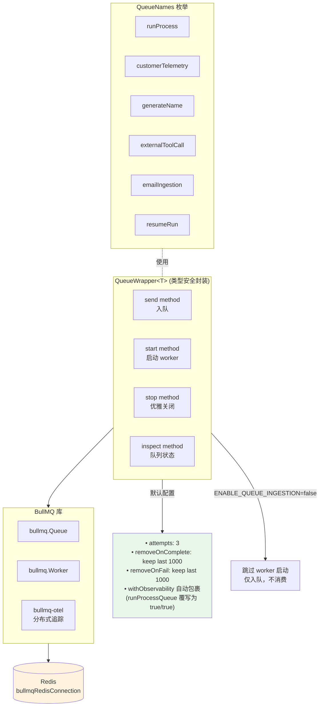
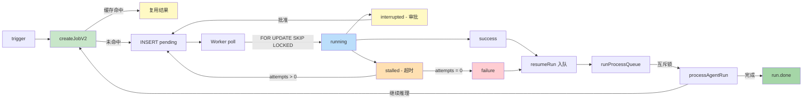

# Inferable 内部机制：Runs & Jobs 任务调度详解

本文档基于源代码深入分析 `control-plane` 中 **`runs`**、**`jobs`** 与 **`queues`** 三大核心模块的内部实现，包含完整的任务生命周期、并发控制、自愈机制与状态机的 Mermaid 流程图。

> 源码路径：`control-plane/src/modules/{runs,jobs,queues}/`

## 目录

1. [模块文件结构](#1-模块文件结构)
2. [核心概念：Run vs Job](#2-核心概念run-vs-job)
3. [Job 状态机](#3-job-状态机)
4. [Job 创建流程（含缓存策略）](#4-job-创建流程含缓存策略)
5. [Worker 长轮询认领任务](#5-worker-长轮询认领任务pollJobsByTools)
6. [Job 结果回写与 Run 恢复](#6-job-结果回写与-run-恢复)
7. [Approval 审批中断流程](#7-approval-审批中断流程)
8. [Self-Heal 自愈机制](#8-self-heal-自愈机制)
9. [Queue 基础设施（BullMQ + Redis）](#9-queue-基础设施bullmq--redis)
10. [Run 处理：分布式锁与重试](#10-run-处理分布式锁与重试)
11. [关键 SQL 模式](#11-关键-sql-模式)

---

## 1. 模块文件结构

```text
control-plane/src/modules/
├── runs/
│   ├── index.ts            ← createRun, resumeRun, cleanupMarkedRuns, deleteRun
│   ├── notify.ts           ← 审批通知 (Slack / Email) + 状态变更通知
│   ├── messages.ts         ← Run 消息持久化
│   ├── summarization.ts    ← Run 摘要
│   └── agent/
│       ├── run.ts          ← processAgentRun (核心 agent 推理循环)
│       ├── agent.ts        ← Agent 编排
│       ├── state.ts        ← 状态机
│       ├── tool.ts         ← 工具调度
│       ├── overflow.ts     ← 上下文溢出处理
│       └── nodes/, tools/
│
├── jobs/
│   ├── jobs.ts             ← pollJobsByTools, requestApproval, submitApproval, cancelJob
│   ├── create-job.ts       ← createJobV2 (含缓存策略)
│   ├── job-results.ts      ← acknowledgeJob, persistJobInterrupt, persistJobResult
│   └── self-heal-jobs.ts   ← selfHealJobs (cron 自愈)
│
└── queues/
    ├── core.ts             ← QueueWrapper (BullMQ 封装), QueueNames 枚举
    ├── index.ts            ← start/stop 全局生命周期
    ├── run-process.ts      ← runProcessQueue + handleRunProcess (互斥锁)
    ├── customer-telemetry.ts
    └── observability.ts    ← withObservability 包装器
```

---

## 2. 核心概念：Run vs Job



| 实体 | 表 | 含义 | 状态枚举 |
|---|---|---|---|
| **Run** | `runs` | 一次工作流执行的整体上下文（含消息、agent 状态） | `pending`, `running`, `paused`, `done`, `failed` |
| **Job** | `jobs` | 一次工具调用 / 函数执行（被某 worker 拉取并执行） | `pending`, `running`, `success`, `failure`, `stalled`, `interrupted` |
| **结果** | jobs.result | `resolution` / `rejection` / `interrupt` 三种结果类型 | — |

---

## 3. Job 状态机



---

## 4. Job 创建流程（含缓存策略）

`createJobV2` 是任务入口，关键代码位于 `jobs/create-job.ts`。



**关键点：**
- **缓存命中**直接复用历史成功结果，避免重复执行（实现 `ctx.memo()`）
- **缓存键**通过 `JSONPath` 从输入参数中提取（确定性 + 灵活）
- **TTL 过期**后自动失效，保证数据新鲜度

---

## 5. Worker 长轮询认领任务（`pollJobsByTools`）

这是 SDK 与 Control Plane 之间最核心的握手机制。源码位于 `jobs/jobs.ts:216`。



**`FOR UPDATE SKIP LOCKED` 的妙用：**
- 多个并发 worker 可以**同时**调用此 API 而不会拿到同一个 job
- 跳过被其他事务锁定的行 → 完全无冲突的水平扩展
- 这是 PostgreSQL 实现"任务队列"的经典模式

---

## 6. Job 结果回写与 Run 恢复

源码 `jobs/job-results.ts`。



**关键设计：**
- **乐观并发**：`status='running' AND machine_id=?` 作为更新前提，避免覆盖 self-heal 已标记 stalled 的 job
- **解耦**：Job 完成后**不直接执行** agent 逻辑，而是入队 `runProcessQueue`，由 worker 异步 pickup → 防止 HTTP handler 长时间阻塞

---

## 7. Approval 审批中断流程

源码 `jobs/jobs.ts:301`（`requestApproval`）和 `:379`（`submitApproval`）。



**Interrupt 设计精髓：**
- 中断不是真正"暂停进程"，而是**写入 DB 状态 + 让 job 短暂消失**
- 批准后**重置回 pending**，由长轮询机制自然回流
- `ctx.approved` 在恢复执行时由 SDK 注入，使代码逻辑得以分支

---

## 8. Self-Heal 自愈机制

源码 `jobs/self-heal-jobs.ts`，由 cron 每 **5 秒**触发。



**容错保证：**
- Worker 崩溃 → `last_retrieved_at + timeout` 超时 → 自动 stalled → 自动 retry pending
- 永不失联：即使所有相关组件全部宕机重启，5 秒内系统恢复一致性
- `remaining_attempts` 提供有限重试，避免无限循环

---

## 9. Queue 基础设施（BullMQ + Redis）

源码 `queues/core.ts`。



**为什么需要 BullMQ 而不只是 PG 表队列？**
| 用途 | 实现 |
|---|---|
| **Job 调度**（用户工作流的工具调用） | PostgreSQL `FOR UPDATE SKIP LOCKED`（持久化、可审计） |
| **Run 处理**（agent 内部推理触发） | BullMQ（低延迟、自动重试、延迟入队） |

两者**互补**：DB 队列保证业务持久性，Redis 队列保证响应性能。

---

## 10. Run 处理：分布式锁与重试

源码 `queues/run-process.ts`。`processAgentRun` 必须保证**同一 run 不会被并发处理**。

```mermaid
flowchart TD
    Start[runProcessQueue 收到消息<br/>{ runId, clusterId, lockAttempts? }] --> Parse[zod 校验 message schema]
    Parse --> TryLock[acquireMutex<br/>'run-process-${cid}-${rid}']

    TryLock -->|获取成功| Acquired[拿到锁]
    TryLock -->|获取失败<br/>已被其他 worker 持有| FailLock{"lockAttempts &lt; 5 ?"}

    FailLock -->|是| Backoff["指数退避<br/>delay = 2^attempts 秒"]
    Backoff --> Requeue["runProcessQueue.send<br/>{ ...msg, lockAttempts: +1 }<br/>+ delay"]
    Requeue --> Done1[当前 worker 释放任务]

    FailLock -->|否 已达上限| Skip["logger.warn<br/>跳过该 run"]
    Skip --> Done2[结束]

    Acquired --> GetRun["getRun: 查 runs 表"]
    GetRun --> CheckLimit{"ephemeral cluster<br/>是否超限 ?"}
    CheckLimit -->|是| Reject[抛错 - 释放锁]
    CheckLimit -->|否| Process["processAgentRun run<br/>—— Agent 推理循环 ——"]

    Process --> Finally["finally:<br/>releaseMutex"]
    Reject --> Finally
    Finally --> Done3[完成]

    style Acquired fill:#c8e6c9
    style Backoff fill:#fff9c4
    style Process fill:#bbdefb
    style Skip fill:#ffcdd2
```

**关键参数：**
- **并发限制**：`runProcessQueue` 的 worker concurrency = **5**（同一进程最多 5 个 run 并行）
- **锁机制**：Redis 互斥锁，name=`run-process-{clusterId}-{runId}`
- **最大重试**：`MAX_PROCESS_LOCK_ATTEMPTS = 5`，超过则放弃（依赖后续 resumeRun 触发）
- **作业清理**：`runProcessQueue` 覆写了 `QueueWrapper` 的默认值，设为 `removeOnComplete: true, removeOnFail: true`——不保留作业历史，因为 run 状态完全在 PG 中跟踪

---

## 11. 关键 SQL 模式

### 11.1 原子性的"领取任务"
```sql
UPDATE jobs SET
  status = 'running',
  executing_machine_id = $1,
  last_retrieved_at = NOW()
WHERE id IN (
  SELECT id FROM jobs
  WHERE status = 'pending'
    AND cluster_id = $2
    AND target_fn = ANY($3)
  ORDER BY created_at
  LIMIT $4
  FOR UPDATE SKIP LOCKED   -- 🔑 关键：跳过其他 worker 锁定的行
)
RETURNING *;
```

### 11.2 缓存命中检查
```sql
SELECT id FROM jobs
WHERE cluster_id = $1
  AND target_fn = $2
  AND cache_key = $3
  AND status = 'success'
  AND result_type = 'resolution'
  AND created_at > NOW() - INTERVAL '$4 seconds'
LIMIT 1;
```

### 11.3 乐观并发结果回写
```sql
UPDATE jobs SET
  status = 'success',
  result = $1,
  result_type = $2,
  resulted_at = NOW()
WHERE id = $3
  AND cluster_id = $4
  AND status = 'running'
  AND executing_machine_id = $5  -- 🔑 防止 self-heal 抢夺后的覆盖
RETURNING run_id;
```

### 11.4 Self-heal 超时检测
```sql
UPDATE jobs SET status = 'stalled'
WHERE status = 'running'
  AND approval_requested = false
  AND last_retrieved_at + (timeout_interval_seconds || ' seconds')::interval < NOW()
RETURNING id, run_id, cluster_id;
```

---

## 总结：调度全链路



---

## 进一步阅读

- [docs/architecture.md](./architecture.md) — 系统级架构与端到端数据流
- [`control-plane/src/modules/jobs/jobs.ts`](../control-plane/src/modules/jobs/jobs.ts) — Job 主调度逻辑
- [`control-plane/src/modules/jobs/create-job.ts`](../control-plane/src/modules/jobs/create-job.ts) — Job 创建 + 缓存策略
- [`control-plane/src/modules/jobs/self-heal-jobs.ts`](../control-plane/src/modules/jobs/self-heal-jobs.ts) — 自愈逻辑
- [`control-plane/src/modules/queues/run-process.ts`](../control-plane/src/modules/queues/run-process.ts) — Run 处理队列与互斥锁
- [`control-plane/src/modules/runs/agent/run.ts`](../control-plane/src/modules/runs/agent/run.ts) — `processAgentRun` Agent 推理循环
